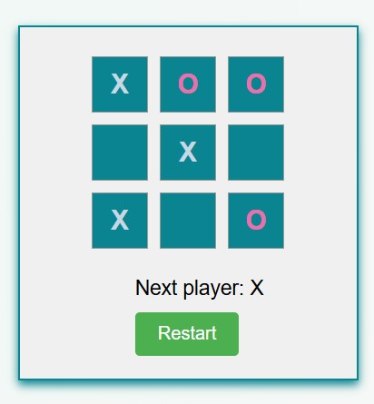

# Tic Tac Toe

A React project to play the classic Tic Tac Toe game with a simple and interactive user interface.

## Features

- Two-player gameplay.
- Highlights the winner and displays the winning line.
- Option to reset the game board.
- Minimalistic and responsive design.

## Installation

1. **Clone the repository**:

   ```bash
   git clone https://github.com/sabarikennady/TicTacToe
   cd tictactoe
   ```

2. **Install dependencies**:

   ```bash
   npm install
   # or
   yarn install
   ```

3. **Run the project**:

   ```bash
   npm start
   ```

4. Open the app in your browser at `http://localhost:3000`.

## How to Play

1. Player X starts the game by selecting a square.
2. Players take turns clicking on an empty square to place their mark (X or O).
3. The game announces the winner or declares a draw if no moves are left.
4. Click "Reset" to start a new game.

## Technologies Used

- **React**
- **JavaScript**

## App Screenshot



## Contribution

Feel free to fork the repository and submit pull requests for any enhancements or bug fixes.

## License

This project is licensed under the [MIT License](LICENSE).

---

Developed with ❤️ using React.

